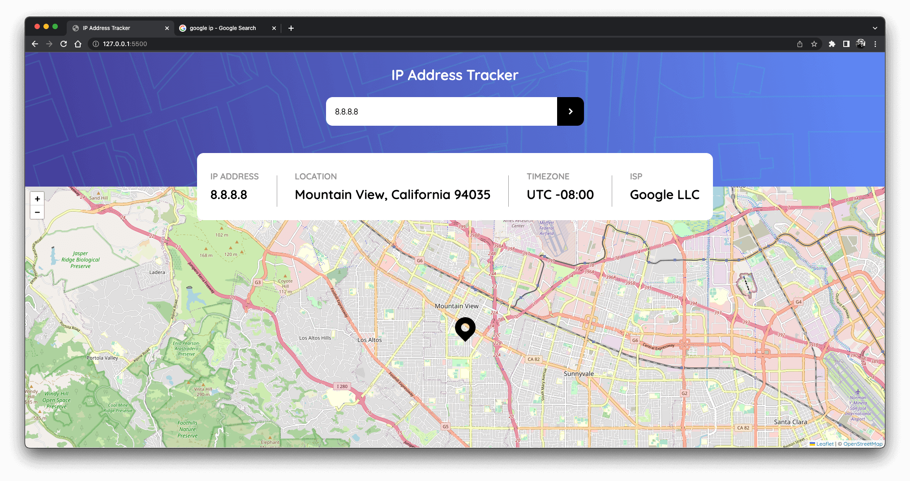
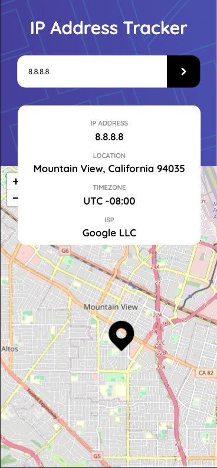

# Frontend Mentor - IP address tracker

## Table of contents

- [Overview](#overview)
- [Screenshot](#screenshot)
- [Links](#links)
- [Built with](#Built-with)

## Overview

- IP address tracker created with HTML, CSS and Javascript.
- Enter any IP address and you will get the the information about that IP address that includes location, time zone and ISP.
- It uses [ipify API](https://www.ipify.org) to get the information about IP address.
- It also uses [leafletjs maps](https://leafletjs.com) to generate the map.

## Screenshot

## Links

- Live Site URL: [https://ip-address-tracker-brijen.vercel.app](https://ip-address-tracker-brijen.vercel.app)

## Built with

- HTML
- CSS
- Javascript
- ipify API
- leafletjs Maps
